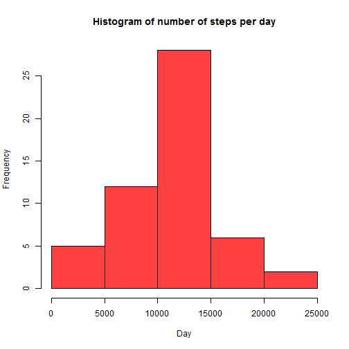
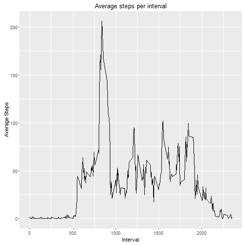
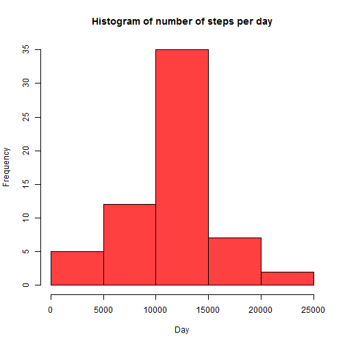
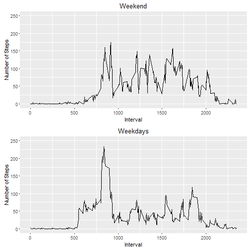

###Loading and preprocessing the data

Set the working file first

```r
setwd("C:/Users/KOLMACIM/Desktop/FTS/COURSERA_DATA_SCIENCE/5_Reproducible_Research/1_Week")
```

Load the file

```r
activity <- read.csv("activity.csv", sep = ",")
```

###What is mean total number of steps taken per day?


```r
steps <- aggregate(activity$steps, by = list(date = activity$date), FUN = sum)

hist(steps$x, col = "brown1", main = "Histogram of number of steps per day", xlab = "Day")
```



Calculate Mean and Median

```r
mean(steps$x, na.rm = TRUE)
```

```
## [1] 10766.19
```


```r
median(steps$x, na.rm = TRUE)
```

```
## [1] 10765
```

###What is the average daily activity pattern?


```r
library(ggplot2)
```

```
## Warning: package 'ggplot2' was built under R version 3.2.3
```

```r
time_series <- aggregate(activity$steps, by = list(interval = activity$interval), FUN = mean, na.rm=TRUE)

ggplot(time_series, aes(interval, x)) + geom_line() + ggtitle("Average steps per interval") + xlab("Interval") + ylab("Average Steps")
```



```r
head(time_series[order(time_series$x, decreasing=TRUE), ],1)
```

```
##     interval        x
## 104      835 206.1698
```

###Imputing missing values

Number of missing values

```r
sum(is.na(activity))
```

```
## [1] 2304
```

Replace missing values by random number in range of 0 - 100


```r
steps_NA <- numeric()

for (i in 1:nrow(activity)) {
  row <- activity[i, ]
  if (is.na(row$steps)) {
    steps <- sample(0:100, 1)
  }
  else {
    steps <- row$steps
  }
  steps_NA <- c(steps_NA, steps)
}

activity_2 <- activity

activity_2$steps <- steps_NA
```


Histogram

```r
steps_2 <- aggregate(activity_2$steps, by = list(date = activity_2$date), FUN = sum)

hist(steps_2$x, col = "brown1", main = "Histogram of number of steps per day", xlab = "Day")
```



Calculate Mean and Median

```r
mean(activity_2$steps, na.rm = TRUE)
```

```
## [1] 39.02038
```


```r
median(activity_2$steps, na.rm = TRUE)
```

```
## [1] 0
```

###Are there differences inkn activity patterns between weekdays and weekends?


Separate the data to weekend and weekdays

```r
activity <- 
  activity %>% 
  mutate(day =
          ifelse(weekdays(as.Date(activity$date, format = "%Y-%m-%d")) == "Saturday" | 
                 weekdays(as.Date(activity$date, format = "%Y-%m-%d")) == "Sunday", "Weekend", "Weekdays"
                 )
        )
```


Create the plot

```r
time_series_wk <- activity %>% filter(is.na(steps) == FALSE & day == "Weekdays") %>% group_by(interval) %>% summarise(x = mean(steps))

time_series_we <- activity %>% filter(is.na(steps) == FALSE & day == "Weekend") %>% group_by(interval) %>% summarise(x = mean(steps))

p1 <- ggplot(time_series_wk, aes(interval, x)) + geom_line() + ggtitle("Weekdays") + xlab("Interval") + ylab("Number of Steps") + ylim(0, 250)

p2 <- ggplot(time_series_we, aes(interval, x)) + geom_line() + ggtitle("Weekend") + xlab("Interval") + ylab("Number of Steps") + ylim(0, 250)

grid.arrange(p2, p1, nrow = 2)
```


